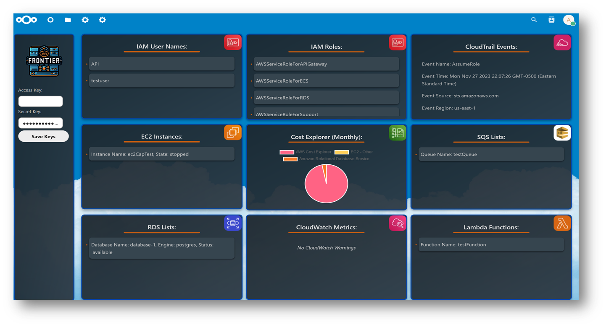

# AWS Frontier: A Nextcloud Integrated AWS Management Tool

**AWS Frontier** is an innovative application seamlessly integrated with Nextcloud, offering a unified and intuitive interface for managing various AWS services. This application is designed for users seeking a streamlined approach to monitor and control their AWS resources efficiently.

## Key Features:
- **Enhanced Security**: Utilizes advanced encryption techniques (AES with CBC mode and Pkcs7 padding) for secure storage and retrieval of AWS API keys in local storage, ensuring sensitive data remains protected.
- **Comprehensive AWS Service Integration**: Offers direct interaction with a variety of AWS services including IAM, EC2, SQS, RDS, CloudTrail, CloudWatch Events, Lambda Functions, and Cost Explorer, providing a centralized platform for managing diverse AWS resources.
- **Real-Time Monitoring and Management**: Enables users to view and manage AWS resources such as IAM users and roles, EC2 instances, SQS queues, RDS databases, and more, facilitating immediate insights and actions.
- **Cost Tracking and Visualization**: Incorporates AWS Cost Explorer API to track and visualize AWS costs, aiding in effective budget management and financial planning.
- **User-Friendly Interface**: Features a responsive, grid-based layout with a clean, modern design, enhancing user experience and accessibility across various devices.

## Technical Details:
- Developed using JavaScript and PHP, AWS Frontier leverages Axios for network requests and CryptoJS for robust cryptographic operations.
- Employs Chart.js for rendering interactive and informative charts, aiding in the visualization of AWS usage and cost data.
- Implements a modular and scalable code structure, making it easy to extend and customize for specific needs.

## Ideal for:
- IT professionals and system administrators who require an all-in-one tool for AWS resource management.
- Organizations using Nextcloud seeking to integrate AWS management within their existing cloud infrastructure.
- Developers looking for a customizable and secure interface to interact with AWS services.
"""

## Note:
- Due to limited storage this repository only contains the main the src files needed for the front-end and back-end. Located in the "code" directory of the repo.
- If you are interested in the full src for further development or use of the application, it can be found in a google drive [here](https://drive.google.com/drive/folders/1ocyJKFK_Is5e3bOa6Yk3M99WSJmgJ7aK?usp=sharing)
- The "code" directory of this repository contains an overview of the source code structure.

